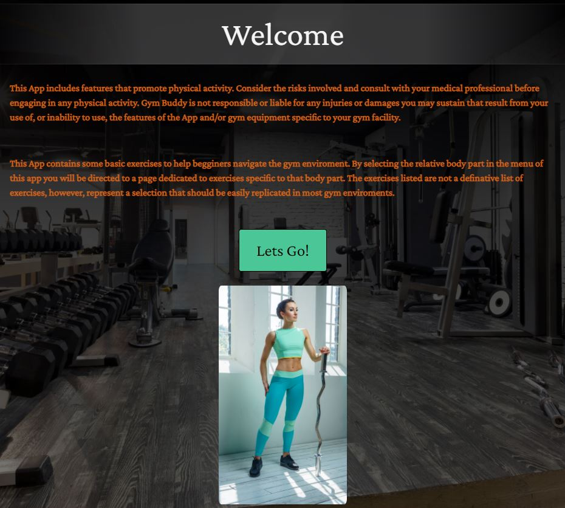

# 

The gym enviroment can be a complex enviroment for people who are new to this type of exercising routine. What many gym enthusists consider simple exercises can appear confussing to anyone not familiar with the concepts.
While many gyms have people on hand who can provide help if asked, this can sometimes depend on availability such as if personal training sessions are in play. There are also usually wall charts which detail various exercises,
however many people are put off viewing such material due to making it very evident of thier new start status. All of these considerations can be overwhelming for many and can put people off from making that all important first
step into the local gym. 

Gym-Budy is a simple and personal solution that provides names, descriptions and images of the most common exercises found in gyms accross the world utilising the most common equipment. To facilitate quick refrencing, 
exercises are grouped per bodypart. This also doubles as an educational approach that allows the user to quickly become familiar with which exercises affect which bodypart. 

---

## UX
 
Due to the multi-page requirements (12 in total) required to provide suitable and clear seperation of the individual bodypart areas commonly trained in the gym enviroment, a clear and decisive navigation bar is required. The Nav-Bar
will need to provide quick, minimal click and logical access to all pages.

Keeping the gym enviroment in mind the Gym-Buddy aplication has the following user consideration when deployed on different devices:

- Mobile - A mobile first approach was considered as it is envisioned that the app can be deployed within the gym enviroment for real time refrencing of the exercises required and to suit the equipment available. This also provides a 
discreat way of refrencing for those self consious about appearing new to the gym enviroment. This is considered the majority user case scenario as the majority will have a mobile phone and will also be utilising this technology
to provide music or health data tracking. 

- Tablet - While less common, a tablet can also be used in the gym enviroment in the same way as a mobile phone. This would provide a larger screen experience for those that chooseprefer this approach. It is also considered that home 
use will be the majority use case for tablets where Gym-Buddy could be used for familiarisation or referece.

- Computer/Laptop - Not imposible but certainly unusual, laptops can be taken into the gym. It is, however, in this use case considered that the computer deployment of this app would be for referencing/educational purposes at home. 
Some people may prefer to log the relavant exercises in a workout diary and use this app from a home computer for reference.

---

## Features
 
### Existing Features

- Navigation Bar - The Navigation bar sits at the top of all pages and offers access to all pages of the application. No more than two clicks are required to access any single page. 

# 

- Home Page - The home page is the first page a user is greated by. On the home page there is some text regarding prerequisites to consult a medical profesional before starting a new fitness routine and a basic instruction of the apps intent.
There is also a large button bellow the text which when pressed takes the user to the menu page.

# 

- Menu Page - The menu page offers a simple button arrangement for each body part which when clicked takes the user direct to the exercise list for the body part selected. Below the buttons is an anatomy chart reflecting the bodyparts contained 
within the app for quick reference of anyone who may not be familiar with the muscle group names. 

# 

- Exercise Pages - The exercise pages for each body part have been given a common layout and look for familiarity of the user. Each page consists of a selection of common exercises accompanied by a descriptive graphic and text relaying the method 
to be used. A user can navigate directly back to the manu page via a single click in the navigation bar, or directly to the next body part/muscle group via the navigation bar drop down menu. 

# 

- Social Links - A social media page has been added to allow users to navigate to the fictional social media and YouTube pages were exercise guidance and routines could be added.

# 

### Features Left to Implement

- Further pages with begginer and intermediate training routine plans including rep ranges and exercise combinations.

- A download page for workout plans and diary pages that can be printed and taken to the gym by anyone who wishes to record thier progress. 

- Real social and Youtube sites.

---

## Technologies Used

- [HTML5](https://en.wikipedia.org/wiki/HTML5) - provides the content and structure forthe my website/application.
- [CSS3](https://en.wikipedia.org/wiki/Cascading_Style_Sheets) - provides the styling.
- [Bootstrap](https://getbootstrap.com/) and [Bootstrap CDN](https://www.bootstrapcdn.com/) - used to create the layout of the project.
- [Balsamiq](https://balsamiq.com/) - used to create the project's wireframes.
- [Gitpod](https://gitpod.io/) - used to develop the website.
- [GitHub](https://github.com/) - used to host the project.
- [Google Fonts](https://fonts.google.com/) - used to provide the fonts Crimson Pro.
- [Font Awesome](https://fontawesome.com/) - used the font awesome icons to style the Gym-Buddy logo in the tope right corner of each page and also for the social links.
- [Depositphotos](https://depositphotos.com/home.html) - used to get all images for the project.

---

## Testing

Testing information is found on a separate file [TESTING.md](TESTING.md)

---

# Deployment

### How I deployed my First Milestone Project remotely to Github pages:

1. Go to [GitHub.com](https://github.com/)

2. Log into my account

3. Click on ‘Repositories’

4. Click on ‘First Milestone Project’

5. Click on ‘Settings’

6. Scroll down to the ‘Github Pages’ section.

7. Under the ‘Source’ heading there is a dropdown menu click on ‘None’, and select ‘Master Branch’.

8. The page refreshes and goes back to the top of the page, scroll down to ‘Github Pages’ section and find ‘Your site is ready to be published at ________’ with your link. The website is deployed.

   [Follow this link](https://help.github.com/en/github/working-with-github-pages/configuring-a-publishing-source-for-your-github-pages-site)
on how to deploy to Github pages.

### How to run code from my First Milestone Project by cloning in Github to Repl:

1. Go to [GitHub.com](https://github.com/)

2. Log into my account

3. Click on ‘Repositories’

4. Click on ‘First Milestone Project’

5. Click on the green button ‘Clone or download’

6. Click on ‘Download Zip’

7. Open IDE [Repl.it](https://repl.it/)

8. Upload folder or files

### How to run code from my First Milestone Project by cloning in Github to Gitpod:

1. Go to [GitHub.com](https://github.com/)

2. Log into my account

3. Click on ‘Repositories’

4. Click on ‘First Milestone Project’

5. Click on the green button ‘Clone or download’

6. Click on the icon that looks like a clipboard on the right side of the URL (this copies URL link)

7. Open repo or create new repo

8. Open terminal

9. Type `git clone` and paste URL link and press enter.

---

## Credits

### Content

- The main text for the exercise descriptions (although altered as required) was taken from [WorkoutLabs](https://workoutlabs.com/exercise-guide/).

- The Navbar and header transparent background styling was taken from a Youtube instructional video [Transparent Navigation Menu Using CSS3](https://www.youtube.com/watch?v=Ebyq2tkXQJc). 

- Code utilised for darkening of the background image was taken from [StackOverflow](https://stackoverflow.com/questions/31632419/how-to-darken-a-css-background-image/31632494).

### Media

- All photographs and images used in this project were obtained from [Depositphotos](https://depositphotos.com/home.html).

### Acknowledgements

[Precious Ijege](https://www.linkedin.com/in/precious-ijege-908a00168/?originalSubdomain=ng) for the mentor guidance and support.

The [Code Institute](https://codeinstitute.net/).