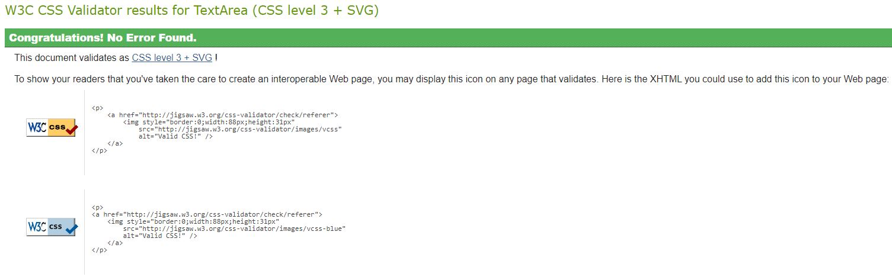

# Testing

## Code validators

[HTML Validator](https://validator.w3.org/) : 

- The test returned no errors.

[CSS Validator](https://jigsaw.w3.org/css-validator/) : 

The test returned the following errors with bootstrap. None of the errors are assiosiated with the CSS used in this project and therfore were not actioned.

## Responsiveness

To test the responsiveness of the site I used [Chrome DevTools](https://developers.google.com/web/tools/chrome-devtools) and [Responsive Design Checker](https://www.responsivedesignchecker.com/).

- Mobile Devices
    - Home Screen: All content appears in correct locations with no overflow to either side. Scrolling works as intended. The navigation bar remians as a single line of 4 tabs on most modern screens and 
    reduces down to 3 tabs with a further tab below on small screens such as the Moto G4. All layouts remain as intended. All buttons and drop down menus work and remain legible on all screen sizes.
    - Menu Screen: All content appears in correct locations with no overflow to either side. The page buttons remain in a single column on all mobile device screen sizes.
    - Exrecise Pages: All content appears in correct locations with no overflow to either side. Exercise titles, images and descriptions apear in a single column and remaain legible. 
    - Social Page: All content appears in correct locations with no overflow to either side. All 3 social link icons remain in a single row on all screen sizes tested.

- Bugs
    - One observation was that in the navigation bar, the social button appears slightly to the right on smaller screens that require a two row nav bar. This did not affect functionality.

- Tablets
    - Home Screen: All content appears in correct locations with no overflow to either side. Scrolling works as intended on smaller tablet sizes. The navigation bar remians as a single line of 4 tabs on 
    all screen sizes.
    - Menu Screen: All content appears in correct locations with no overflow to either side. The menu main buttons appear as 3 rows of 3 as intended due to a single column creating to much space either side 
    on this size screen.
    - Exercise Pages: All content appears in correct locations with no overflow to either side. Exercises appear in two columns which fits the tablet screen size well. Dropdown menu and buttons all work as intended.
    - Social Page: All content appears in correct locations with no overflow to either side. Social icons apear in a single row. Dropdown menu works as intended.

- Laptops / Computers
    - Home Screen: All content appears in correct locations with no overflow to either side. The navigation bar remians as a single line of 4 tabs. 
    - Menu Screen: All content appears in correct locations with no overflow to either side. The navigation bar remians as a single line of 4 tabs. Menu main page buttons apear as 3 rows of 3 buttons to better fit 
    the screen space.
    - Exercise Pages: All content appears in correct locations with no overflow to either side. Exercises appear in two columns which fits the screen area well. Dropdown menu and buttons all work as intended.
    - Social Page: All content appears in correct locations with no overflow to either side. Social icons apear in a single row. Dropdown menu works as intended.

## Browser compatibility

The following browsers were used to view the project:
- Google Chrome
- Microsoft Edge
- Firefox
- DuckDuckGo
- Safari

The browsers were deployed directly on mobile, tablet and laptop devices. 

No issues were observed on any of the browsers accros the tested devices. 

## Runtime Performance

A runtime performance test was performed during the following parameters.
    - From the home screen click the Lets Go! button.
    - From the menu page click the body part button for Back.
    - From the body part page for back click on social.
    - From the social page click the drop down menu and select the body part Biceps.

The following values were obtained:

The values are summerised as follows:

The results are found to be acceptable with no bottlenecks observed.

## Testing User stories

- As the creator, I want to provide a descreet application that can be easily deployed.
  - The user can easily deploy the app on a multitude of mobile devices.
  - All options are avilable to the user from all pages making navigation quick to limit the total amount of time spent looking for the required information.

- As the creator, I want to offer visually simple instructions for quick reference in a gym enviroment.
    - The application arranges the exercises per bodypart to provide the user with a quick reference of purpose.
    - The user is given a simple graphic and a further detailed description for each individual exercise.

- As a creator, i want to provide further value through resources that may not be suited to the gym enviroment.
  - Social links are provided on a seperate page which would offer further instruction and guidance to those who wish to explore further complexities.

- As a user, i want quick and simple navigation for use in a potentially busy gym enviroment.
  - The user can find simple, large buttons on the menu page for each body part they wish to exercise.
  - Navigating to a different bodypart can be done through the dropdown navigation, saving on having to return to the main menu. 

- As a user i want a list of exercises that require the equipment available to me in my chosen gym.
 - The exercises contained within the project are considered the most common and provide the core of many begginner to advanced routines.

- As a user who is a begginer, i want help in learning the musclegroup terminology.
 - An anotomy chart has been added to the menu page for quick reference.

 - As a user, i want further resources to help progress my fitness journey and keep my interest.
  - Social links have been added which would provide further guidance and content to those seeking it.

 

## Bugs 

- The Font awsome icon used for the Gym-Buddy logo would not disply. . 
  - This was solved by updating the Font Awesome link to version 5.

- Deploying the project wouldnt work. 
  - Placing the HTML files in a folder had caused read issues. Removing the files solved this issue.

[Go back to README.md file](README.md).